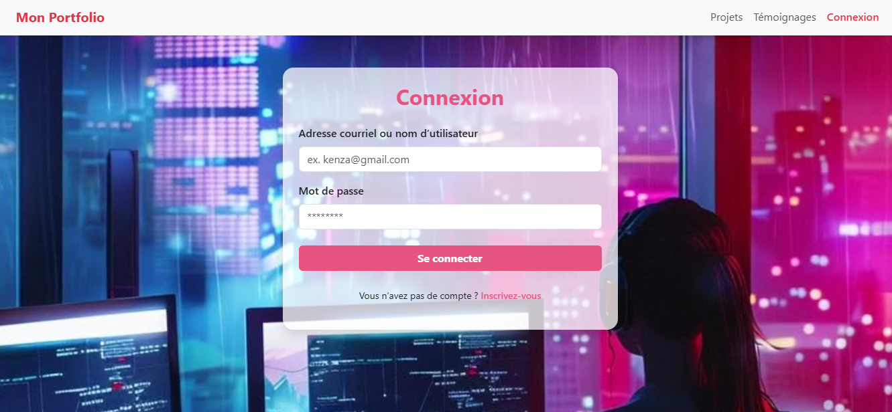
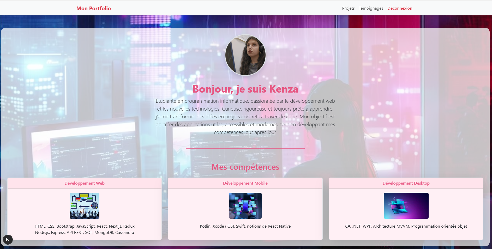
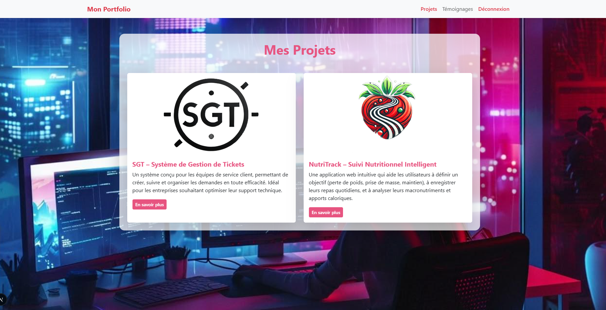
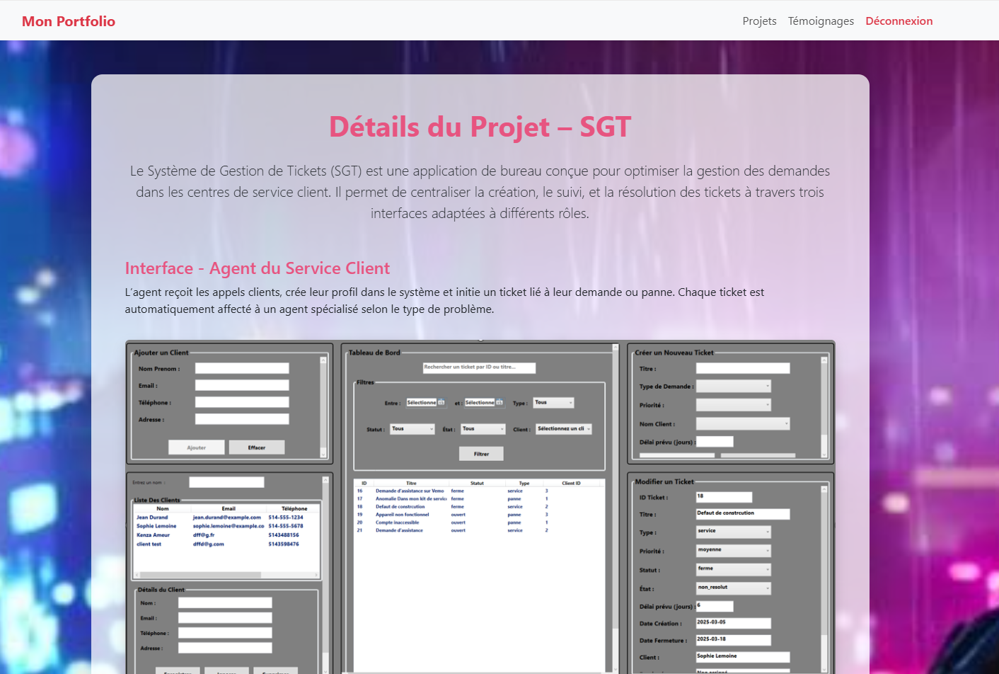
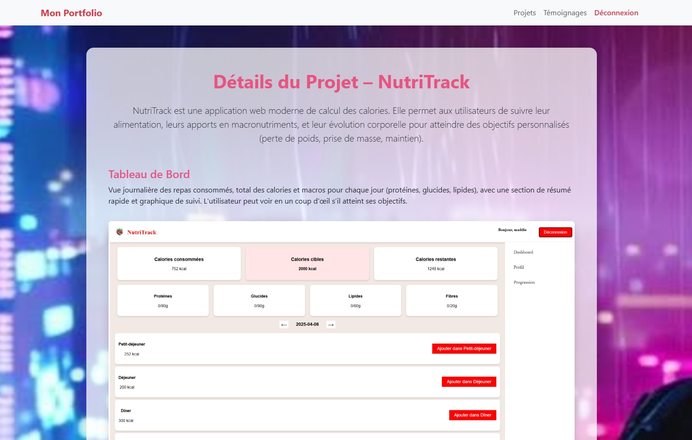
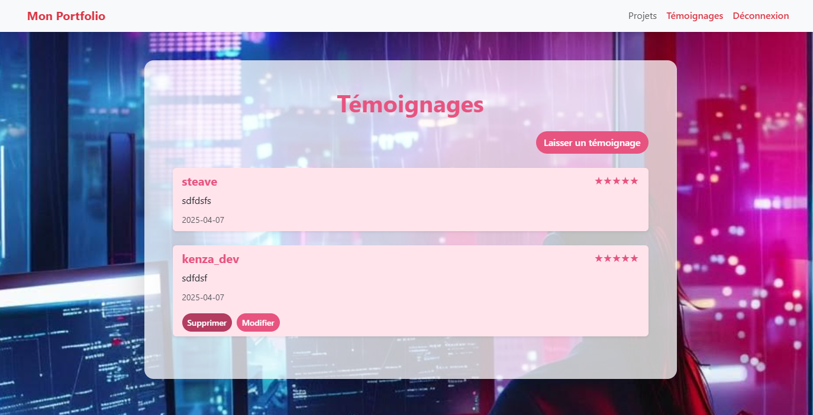
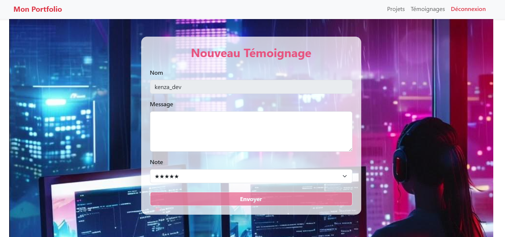

#  Portfolio de Kenza

Bienvenue dans mon portfolio personnel réalisé avec **Next.js**, qui met en valeur mes compétences, mes projets et permet aux utilisateurs de se connecter pour accéder à plus de fonctionnalités.

---

##  Technologies utilisées

- **Next.js** – Framework React puissant avec génération de pages côté serveur.
- **React & Redux Toolkit** – Gestion d'état pour l'inscription, la connexion et les témoignages (sans backend).
- **Bootstrap 5** – Pour un design responsive et élégant.
- **AOS (Animate On Scroll)** – Pour les animations fluides lors du défilement.
- **LocalStorage** – Sauvegarde des données (utilisateurs, témoignages) côté client.
- **CSS personnalisé** – Palette de couleurs personnalisée autour du rose.

---

##  Pages du portfolio

| Page | Description | Capture d'écran |
|------|-------------|-----------------|
| **Connexion** | Formulaire de connexion avec validation en direct. |  |
| **Accueil** | Page d’accueil avec ma photo, une présentation de moi, et un résumé de mes compétences. |  |
| **Projets** | Deux projets présentés avec possibilité d’en savoir plus. |  |
| **Projet SGT** | Application de gestion de tickets (3 interfaces détaillées). |  |
| **Projet NutriTrack** | Application de suivi nutritionnel intelligent. |  |
| **Témoignages** | Liste des témoignages avec étoiles, suppression et modification (accès réservé). |  |
| **Nouveau témoignage** | Formulaire pour laisser un avis, avec note et message. |  |

---

##  Sécurité et accès

- Toutes les pages sont **protégées** sauf `/connexion` et `/inscription`.
- Si un utilisateur **rafraîchit la page**, il est automatiquement **déconnecté** pour plus de sécurité.
- Seuls les utilisateurs inscrits peuvent :
  - Accéder aux projets
  - Voir et poster des témoignages
  - Modifier ou supprimer **leurs propres** témoignages

---

##  Fonctionnalités Redux (sans backend)

-  **Inscription / Connexion** : Stockées en `localStorage`
- **Témoignages** : Ajout, modification, suppression
-  **Validation intelligente** : Champs vérifiés avec messages d'erreur en temps réel

---

##  Instructions pour tester

1. Cloner le projet
2. Lancer avec `npm run dev`
3. Visiter [http://localhost:3000](http://localhost:3000)

---

Merci d’avoir visité mon portfolio 💗  
Si tu veux discuter d’un projet ou d’une opportunité, n’hésite pas à me contacter !
